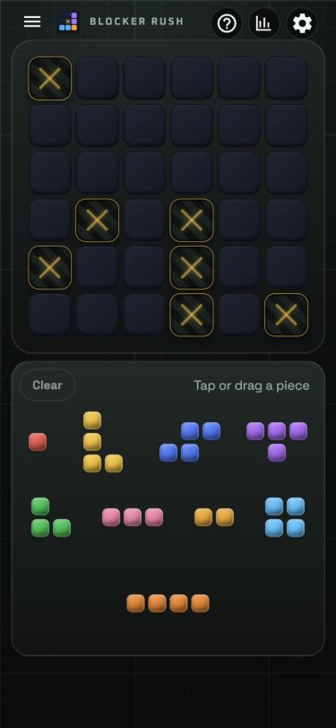
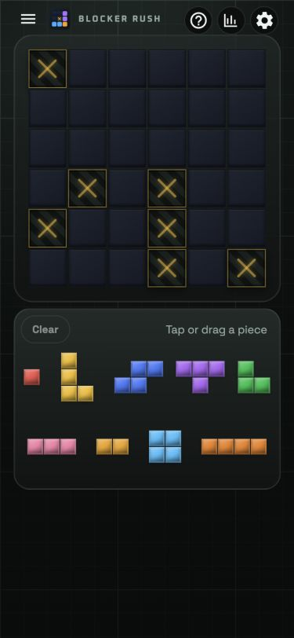
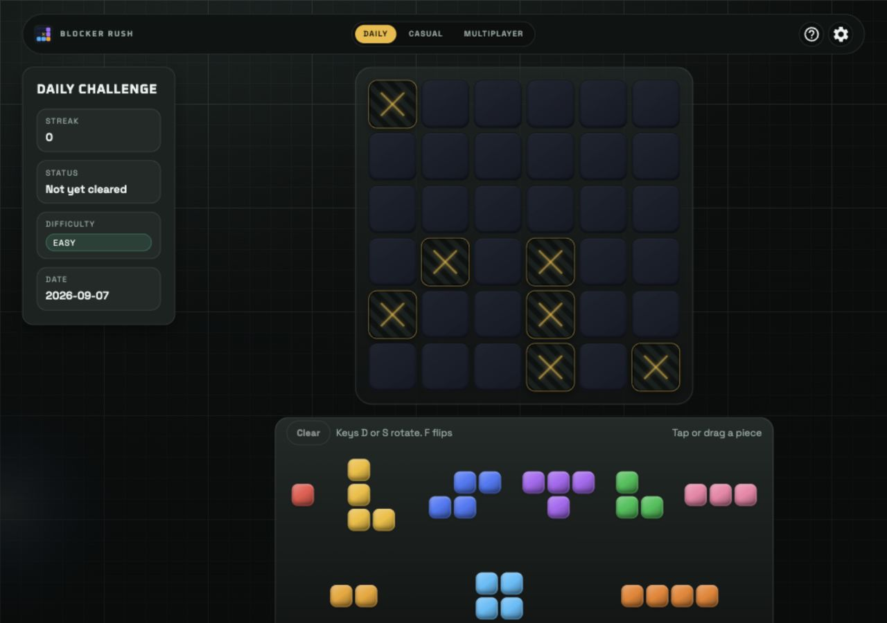
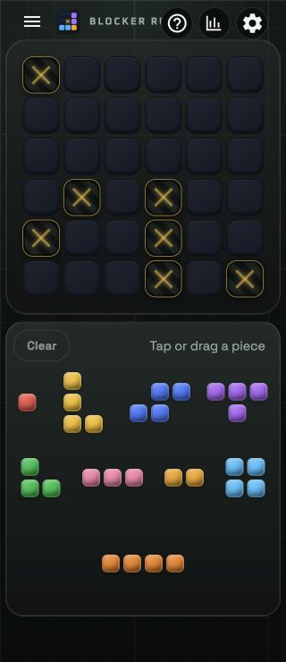
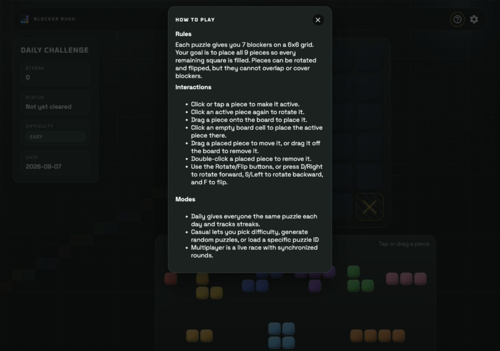
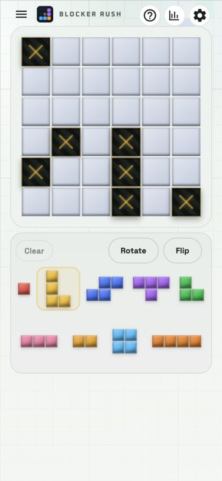
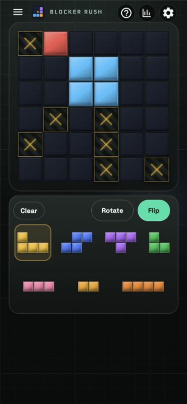
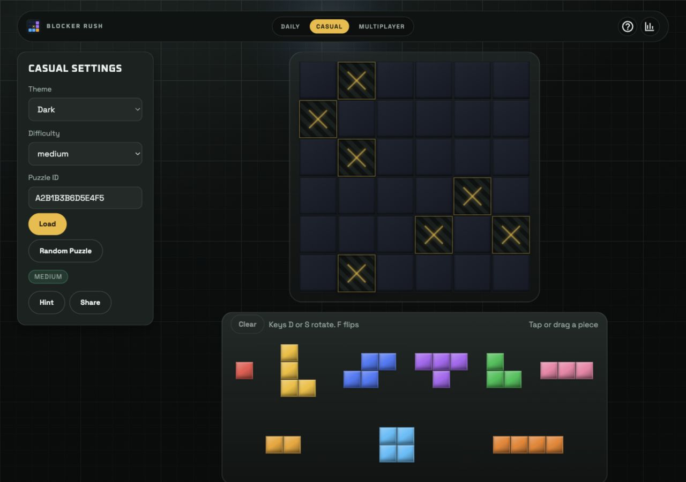
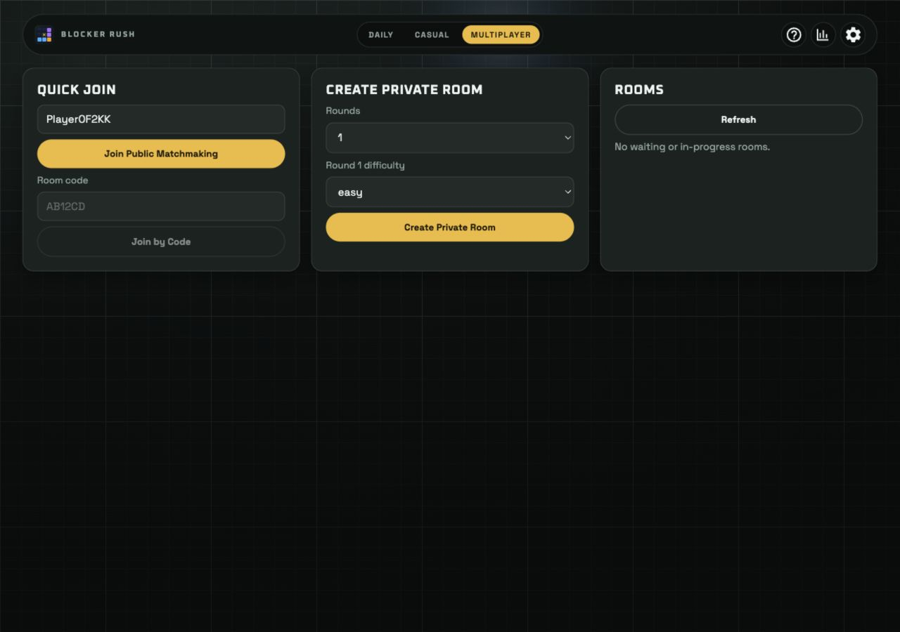

# Blocker Rush design audit and critique

**Update, September 7, 2026:** all 3 P1 and 7 P2 findings below, plus the independent critique’s smaller follow-ups, are now implemented. See [the resolution report](fixes.md) for the Impeccable flow, verification results, screenshots, and the intentional decision to keep the optional P3 font choice.

The original audit follows as historical evidence of the problems and the initial square-block refinement.

**Verdict:** the colorful pieces, crossed blockers, and dark arcade board give the game a clear identity. Preserve them. The largest opportunities are making the first successful placement obvious, supporting keyboard play, and giving players useful feedback and recovery controls.

Used the official [Impeccable getting-started guidance](https://impeccable.style/tutorials/getting-started/), [audit](https://impeccable.style/docs/audit/), and [critique](https://impeccable.style/docs/critique/) playbooks. Two subagents independently reviewed design and technical quality. The design assessor did not see detector findings before completing its judgment. The root agent captured the browser, reproduced interactions, implemented the requested CSS, and synthesized the results.

## Implemented refinement

| Surface | Before | After |
|---|---|---|
| Board, blockers, placed pieces | Rounded cells; 6px desktop / 4px phone gaps | Square cells; 2px gaps |
| Tray piece cells | 9px desktop / 6px phone corner radius; 4px gaps | Square cells; 1px gaps |
| Drag preview and placement ghost | Local corner-radius overrides | Inherit the same square geometry and measured board spacing |
| Multiplayer result miniatures | Rounded cells; 3px desktop / 2px phone gaps | Square cells; 1px gaps |

The existing colors, shading, shell, and game mechanics are preserved. Geometry is shared through the existing CSS tokens and computed board metrics. At 375px wide, the tighter tray now fits the nine pieces into two rows instead of three.

Before, 375 × 812:

After, same viewport:

## Flow reviewed

| Step | Surface and action | Health | Evidence |
|---|---|---|---|
| 1 | Open Daily at desktop and phone sizes | Immediately playable by pointer; mobile context and 320px header need attention | Screenshots 01, 02, 04, 05, 06, 09 |
| 2 | Open How to Play and Settings; switch light/dark | Rules are accurate and themes render; instructions are dense and modal focus is incomplete | Screenshots 03, 08; DOM focus inspection |
| 3 | Select, place, drag, rotate, flip, and clear test pieces | Pointer operations pass after the CSS change; keyboard selection fails | Screenshot 07; cell occupancy and transform checks |
| 4 | Open Casual and type in Puzzle ID after selecting a piece | Layout works; D/F input is swallowed by game shortcuts | Screenshot 10; keyboard reproduction |
| 5 | Open Multiplayer lobby | Entry choices and empty state are visible; labels need improvement | Screenshot 11; live match/results not exercised |

### Step 1 — Daily composition

The board is prominent, but four separate metadata cards pull the composition to the right. The tray's bottom edge extends below a 900px-high desktop viewport even though the last piece row is visible. A compact date/difficulty/streak strip would give the game more room.

At 320px, utility icons cover the end of the title. This is a header collision, not horizontal page overflow: measured document width remained 320px, and the board shell stayed within the viewport.

### Step 2 — Help and theme

The rules explain the goal correctly, but newcomers must open a utility icon and retain seven interaction bullets. Put “Fill every empty square with all 9 pieces” beside the board, and reveal rotation/removal guidance when relevant. Opening Settings left keyboard focus on its trigger behind the dialog.

Both themes retain clear blocker patterns and piece colors. This was a visual theme check, not a full contrast compliance assessment.

### Step 3 — Placement and transforms

Click placement filled cell 1 with Dot; dragging Square filled cells 8, 9, 14, and 15. All placed cells computed to 0px corner radius. Rotate and Flip changed Spire's cell coordinates correctly. The game’s existing amplified drag movement and upward offset apply during dragging. An initial rejected drop returned the piece without a reason, illustrating the recovery issue below.

### Step 4 — Casual

After selecting Spire, typing `df` into Puzzle ID left the value unchanged: the global game shortcuts consumed both letters. This confirms the source finding in the browser. The test did not load or replace the puzzle.

### Step 5 — Multiplayer entry

The lobby presents public matchmaking, private room creation, and rooms clearly. The populated display-name field has no persistent visible label. No match was joined or created; results miniatures were reviewed through shared source and CSS only.

## Priority findings

There are **3 P1 issues, 7 P2 issues, and 1 optional P3 concern** in this synthesis. No P0 was identified within the tested scope.

| Priority | Finding and player impact | Recommended change | Evidence |
|---|---|---|---|
| P1 | Keyboard players cannot select or place pieces | Enter/Space selection, focusable board navigation, keyboard placement/removal, and occupancy labels | Enter on Dot left `aria-pressed=false`; `PiecesTray.tsx:117`, `GameBoard.tsx:64` |
| P1 | Global shortcuts swallow text and native-control keys | Ignore editable targets and modal contexts; scope shortcuts to the active game surface | Casual `df` reproduction; `GameContext.tsx:294` |
| P1 | Dialog focus stays behind the modal | Initial focus, focus containment, inert background, and trigger-focus restoration | Settings focus remained on “Open settings”; `GameHeader.tsx:328` |
| P2 | Phone hides objective and current mode | Persistent compact mode/date and one-sentence goal; contextual hints | Phone and Help screenshots; `GameHeader.tsx:71` |
| P2 | Rejected moves are silent and Clear has no Undo | Brief board-local invalid-placement reason, Undo, and polite status announcements | Failed drag; `GameContext.tsx:348`, `GameContext.tsx:915`, `GameBoard.tsx:109` |
| P2 | Desktop metadata and tray consume too much space | Combine secondary stats and make the full board/tray fit common laptop heights | Desktop screenshots; `DailyGame.tsx:242` |
| P2 | 320px header overlaps its title | Reserve an explicit actions column; abbreviate title at the narrowest size | Screenshot 05; mobile `.header-actions` in `globals.css` |
| P2 | Reduced motion does not cover all effects | Static completion alternative; skip fireworks and decorative trails | `WinnerFireworks.tsx:35`, celebration CSS; source finding |
| P2 | Background redraws the whole viewport while idle | Cache stationary grid; animate only while state is changing | `InteractiveGridBackground.tsx:279`; source finding, unprofiled |
| P2 | Multiplayer field purposes disappear when populated | Persistent display-name and room-specific code labels | Screenshot 11; `MultiplayerLobbyLanding.tsx:129`, `:254` |
| P3 | Detector flags the existing Space Grotesk face | Optional brand choice; no font replacement needed for this task | Three instances of one `overused-font` rule |

P1 items should be addressed before release. The next design pass should prioritize the visible objective, Undo/feedback, and compact layout. Keep all nine pieces visible: their complexity belongs to the puzzle and should not be hidden behind interface controls.

## Diagnostic scores and strengths

These are reviewer judgments on the inspected implementation, not measured usability, performance, or certification results.

| Technical dimension | Score / 4 |
|---|---:|
| Accessibility | 1 |
| Performance | 2.5 |
| Theming | 3 |
| Responsive design | 2.5 |
| Implementation integrity | 3 |
| **Total** | **12 / 20 — significant work remains** |

The independent critique scored **21 / 40** across ten usability heuristics. Its design-specificity verdict was **pass**: this looks like a block puzzle, with a consistent material and color vocabulary. The low areas are efficient keyboard operation and error recovery, not lack of visual personality.

Retain the immediate access to play, all nine visible shapes, consistent piece colors, blocker X/pattern redundancy, and shared board/tray styling. The detector's font warning does not outweigh these product-specific strengths.

## Verification and limits

- `npm run typecheck -w apps/web` passed; `git diff --check` passed.
- Browser inspected at 1280×900, 552×804, 375×812, and 320×740; dark and light themes checked. No horizontal overflow was measured at 320px or 375px before the change.
- Verified final computed board gap 2px, tray gap 1px, and board/piece/highlight radius 0px. Pointer placement, dragging, Rotate, Flip, and Clear passed. The test placements were cleared and Daily/dark/default viewport restored.
- Official `impeccable@4.0.4` source detector ran over the app and again over the final two CSS files. Final output contains only the same three existing font warnings; exit 2 denotes findings. No new dependency or persistent hook was added.
- The online skill read was v4.2.2. The context loader eventually ran from `apps/web`, finding an existing design and allowing this narrow refinement despite missing PRODUCT.md/DESIGN.md.
- No screen-reader session, physical touch-device test, performance trace, full contrast sweep, solved celebration, or live multiplayer match was performed. Performance and reduced-motion findings are grounded in source, not timing measurements. Ghost/drag/miniature style consistency was checked in source; no held-drag or results screenshot is claimed.

Full independent assessments: [Design critique](independent-critique.md), [technical audit](technical-audit.md). Their source-only limits describe those agents' individual work; browser confirmations above were added by the root agent. [Final detector JSON](detector.json) is also saved.

Suggested sequence: `/impeccable harden` for keyboard, shortcuts, dialogs, and recovery; `/impeccable onboard` for first-play clarity; `/impeccable adapt` and `/impeccable layout` for narrow headers and desktop composition; `/impeccable optimize` for idle rendering; finish with `/impeccable polish`. These can be run individually or together, then checked with a new audit.
